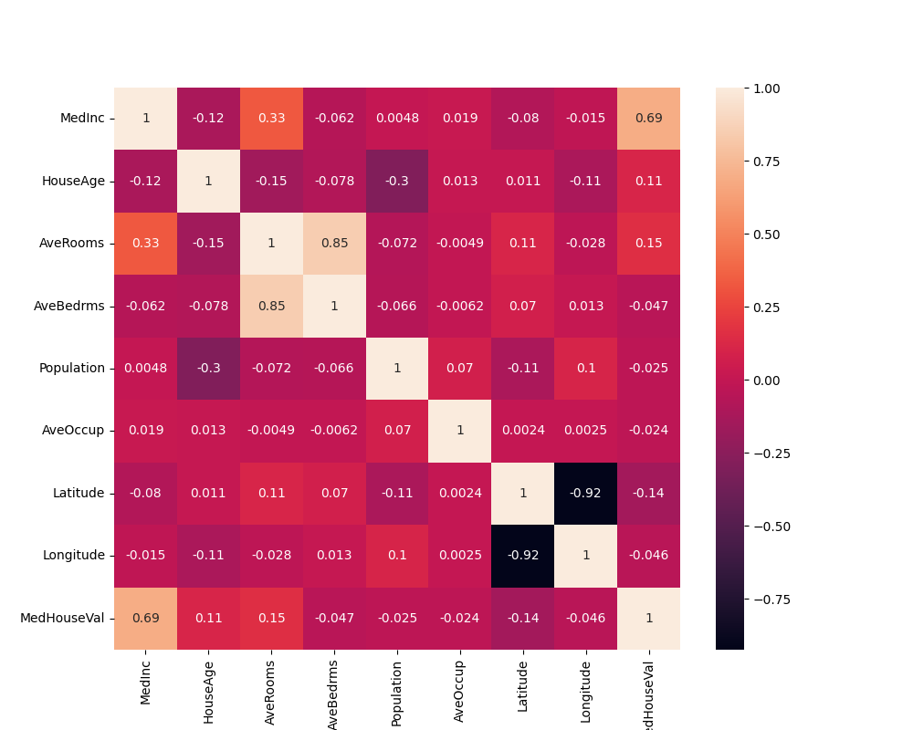
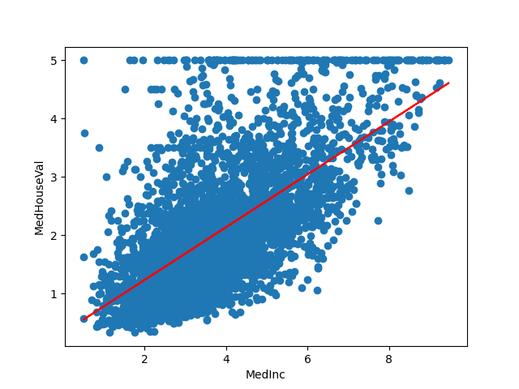

# Linear Regression

This project implements a Linear Regression model from scratch using NumPy, along with data loading and preprocessing for the California Housing dataset.

## Project Structure

* `model.py`: Contains the `LinearRegression` class with `fit`, `predict`, `score`, and `means_squared_error` methods.
* `data_loader.py`: Handles loading and splitting the California Housing dataset.
* `statistics.py`: Provides functions for outlier detection and removal (Z-score, IQR).
* `main.py`: Main script to train and evaluate the model.

## Dataset

* California Housing dataset, focusing on `MedInc` (Median Income) as the predictor.

## Key Features

* Custom Linear Regression implementation.
* Data loading and train-test split.
* Outlier removal using Z-score.
* R-squared and RMSE evaluation.

## Results

### Model Performance

* **R-squared (R2):** Approximately 0.43
* **Root Mean Squared Error (RMSE):** Approximately 0.84

### Visualizations

**Correlation Heatmap:**

This heatmap shows the correlation between the features, highlighting the strong positive correlation between `MedInc` and `MedHouseVal`.

**Scatter Plot (MedInc vs. MedHouseVal):**

This plot shows the linear regression fit, indicating a moderate positive relationship between `MedInc` and `MedHouseVal`.

## Usage

1.  Clone the repository.
2.  Run `main.py` to train and evaluate the model.

## Notes

* The model's performance is limited by using only `MedInc` as a predictor.
* Further improvements can be made by exploring feature engineering, non-linear models, or additional outlier handling techniques.
